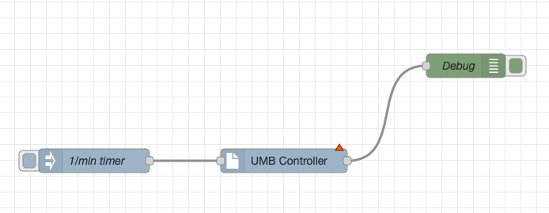
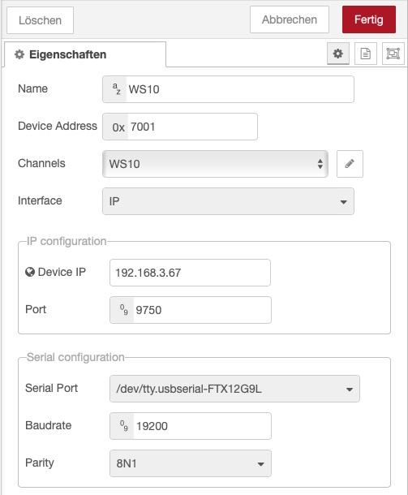

# UMB controller node

This node can be used to query measurement data from Sensors that support the UMB binary protocol.

The purpose of this node is to periodically poll and parse measurement data from a device. In UMB the measurement values of a sensor/device is organized in channels. The channels to be queried can be configured in the node settings. Furthermore, as every sensors reports the featured channels generically, the node is able to query the channels, that are offered by the sensor dynamically.

## UMB protocol details

UMB stands for Universal Measurement Bus. It basically is a RS485 based hardware
interface and protocol, that is used by most meteorological sensors from the
company by Lufft / OTT Hydromet.
The UMB protocol that is used on these sensors is an open standard. There are
different variants available for ASCII and binary ouput.
This node implements the **UMB binary** protocol.

For more details about the according sensors and the UMB protocol please visit: https://www.lufft.com/download/manual-lufft-umb-protocol-en/ or https://www.otthydromet.com

### What you need to know ###

Important to know about UMB, is that it is a "Master-Slave" or "Controller-Device" protocol. This means that the bus topoligy featues the connection of different devices but **there can only be one controller**. The devices are not allowed to send data on the bus themselves. Moreover the Controller sends a request to one device or a group of devices (broadcast). The according device then has a time slot to respond to this **request** with an according **response**.


#### Addressing

Every device on the bus should have an address that is unique.

> **_NOTE:_** The address consist of a device and a group address. For more details, please refere to the protocol specification, that is mentioned above.

The Controller always has the address **0xF001**.

# Usage



## Input

The input needs ot have no data. It is just used as a trigger to query the configured measurement data.

## Output

If the node detects an error, the payload will just contain the according error message.

The output of a properly processed payload consists of mainly two objects:

* **parserState**
  This object represents the internal state of the parsed data. Usually this object is set to "finished", which indicates, that the configured requests have been processed properly and an according response was parsed properly.
* **umbframe**
  This object contains detailed data of the processed frame

**_*Sample output:*_**

```json
{
  "parserState":"finished",
  "umbframe": {
    "type":"response",
    "payload {"0":0,"1":1,"2":8,"3":0,"4":100,"5":0,"6":22,"7":69,"8":177,"9":142,"10":64 },
    "cmd":47,
    "status":0,
    "crc":8566,
    "FromAddr":28673,
    "ToAddr":61441,
    "framedata": {
    	"name":"Multi channel data",
    	"raw":[ {
      	"ch_number":100,
      	"ch_data_type":"FLOAT",
      	"ch_status":0,
      	"ch_value":4.459139347076416
    	}],
    	"parsed":{
      	"Temperature":4.46
    	}
  	}
	}
}
```

### umbframe details

the *umbframe* object contains all the parsed information:

* **type**
  "response" or "request".

  > **_NOTE:_** With this node this will be always "response"

* **payload**
  Raw payload data that can be used for debugging.

* **cmd**
  Parsed UMB command

* **status**

  Parsed UMB status

* **crc**
  CRC within the UMB frame. The CRC is always parsed and verified. If a frame CRC error is detected this is reported in an according *parserState*. Hence, this value is only set, when the UMB framing including the CRC was correct.

* **FromAddr**

  Address of the devices that sends the response

* **ToAddr**

  The address of this node.

  > **_NOTE:_** As this node is designed to be the controller in the UMB setup, this value will alwys be "0xF001"/"61441"

* **framedata**
  This object contains more detailed information about the data that has been received.

### framedata details

The framedata object contains information that will be important for most applications.

The internal UMB parser of this node is generally able to parse multiple different response types. But as this node mainly is designed to query for measurement data, the response will mostly be a "Multi channel data" response. This response contains all the measurement data that has been [configured](#Configuration) accordingly.

Besides the name, this object contains the **raw** data and the **parsed** data of the response.

The **raw** object contains an array of the measurement channels that have been queried.

The **parsed** object contains the parsed data.

```json
msg.payload.umbframe.framedata.parsed: {
	"Temperature":4.46,
	"Humidity":78.2
}
```

> **_NOTE:_** Please note that parsing only works properly when you have selected unique channels. Most devices feature identical channels for different unit systems. If you have selected the same measurement (e.g. temperature) with different units (°C and °F) the node will report an according warning, as both measurement values would be parsed with the same measurement name (in this example "Temperature").

# Configuration



The basic configuration of the node includes:

* **Name**
  Name of the device.

* **Device Address**
  Device address.
  
  >**_NOTE:_** Please note that the address must be entered in hex format
  
* **Channels**
  The channel configuration is a separate configuration, that defines a set of measurement channels to be queried. Please refer to the [channel configuration](#channel_configuration) for details.

* **Interface**
  The node supports UMB communication via IP and Serial interfaces. There a two separate sections for the individual configuration parameters

* **IP configuration**

  * **Device IP**

    IP of the UMB device to be queried

  * **Port**
    TCP Port of the device _(Default: 9750)_

* **Serial configuration**

  * **Serial Port**
    A list of available serial interfaces (ttys) will be provided. Please select the interface, that interferes to the RS485/UMB interface

  * **Baudrate**
    Baudrate to be used _(Default: 19200)_

  * **Partity**
    Parity to be used. Currently only two settings are allowed: 8N1 and 8E1 _(Default: 8N1)_


## <a name="channel_configuration">Channel configuration</a>


Each channel definition consists of 3 values:

* a **channel ID** - indicated with a # at the begining
* a **channel name** - is automatically queried or can be modified manually
* A **Unit** - defines the unit of the acoording meausrement

The check box at the left of each measurement activates or deactivates the channel.

A measurement channel can be deleted from the configuration using the cross at the right side of the measurement entry.

#### Add channel manually

Below the channel list is a **+** button that allows you to add channels as you need.

#### Query device channels

The download button right beside the Channels label can be used to query a new channel list from the device. As there very often exist multiple measurement channels with different units, e.g. Temperature in °C and °F, you may select the according unit system used in your application.

> **_NOTE:_** Please note that all existing channels will be deleted when retrieving a new channel list from the device.

## Query measurement channels from the device

> **_NOTE:_** Please note that the device must be powered  to query the supported channels.

The configured channels will be queried from the device, everytime the input port is triggert. The input data  is not evaluated.

# Known issues

## FAQ

**Q:** I get a "multiple measurements" warning
**A:** Please verify that you don't query multiple channels with the same name (e.g. different units). See [frame details](#frame details) description

## Bugs

No bugs are known yet.

# Planned features

### Implement status request feature to ping a device

Every UMB device features a status command, that can be used to ping a device. This is helpful to verify that the basic configuration and setup is working properly.
